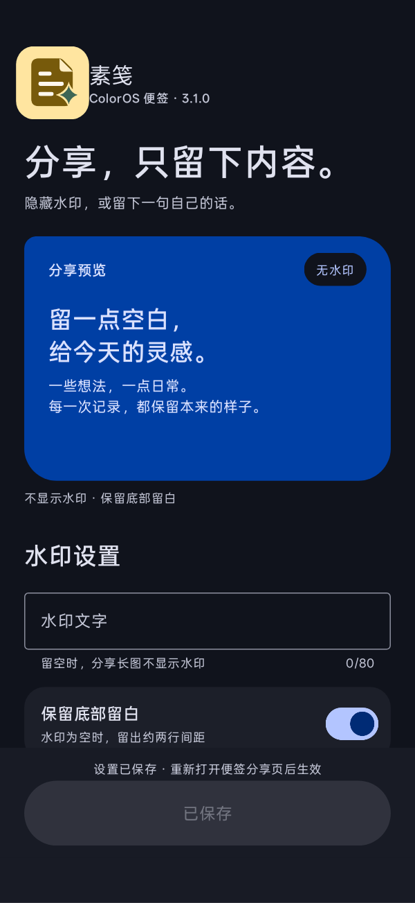

# 素笺


ColorOS 便签模块：移除或自定义分享长图底部的水印，并把全部便签导出为 ZIP。

按 ColorOS 16.0.10、便签 16.6.22 核验。

## 界面

Material 3 Expressive 风格，支持系统深浅色，Android 12 起跟随系统动态配色。设置页带实时示意预览、80 字输入计数与未保存提示，旋转屏幕保留草稿与进行中的导出状态。

<details>
<summary>查看浅色与深色界面</summary>

 

</details>

## 运行条件

- ColorOS 便签 `com.coloros.note`
- 可为便签启用模块作用域的 Xposed 兼容框架

## 安装

1. 安装市场发布的 `NoteWatermark.apk`
2. 在框架中启用模块，把 `com.coloros.note` 加入作用域
3. 冷启动便签
4. 打开「素笺」，设置水印文字；留空表示不显示水印

## 导出便签

在同一设置页选择「导出全部便签」。ZIP 保存到系统「下载」目录，按便签分类写入文本、HTML 与附件；加密便签不导出，只在导出说明中计数。

## 构建

```sh
curl -fsSL -o libs/r8.jar https://maven.google.com/com/android/tools/r8/8.9.35/r8-8.9.35.jar
./build.sh
```

产物为 `build/NoteWatermark.apk`。首次构建会在 `keystore/` 生成签名密钥，该目录不纳入 Git；更换密钥后，旧版本需先卸载才能安装新包。

应用图标是 `res/` 下的矢量资源（`mipmap-anydpi` 基础版、`-v26` 自适应、`-v33` 单色），由 `scripts/generate-icons.py` 从 `artwork/*.svg` 生成，`--check` 可校验。市场用的 512×512 PNG 另经 `scripts/render-icon.cjs` 导出。

## 界面验证

运行 `bash tests/build.sh` 构建独立的真机测试 APK，用同一签名安装后执行 `am instrument -w com.jy.notewatermark.test/.DesignSmoke`。测试覆盖保存、清空、草稿与导出状态重建、深浅色文字对比度，以及 320dp / 200% 字号布局；不导出真实便签，结束后恢复原设置。

覆盖安装后模块管理器对图标的缓存不会自动刷新，`am force-stop org.matrix.vector.manager` 再打开即重读。

## 许可证

可按 [Apache-2.0](LICENSE-APACHE) 或 [MIT](LICENSE-MIT) 使用。
